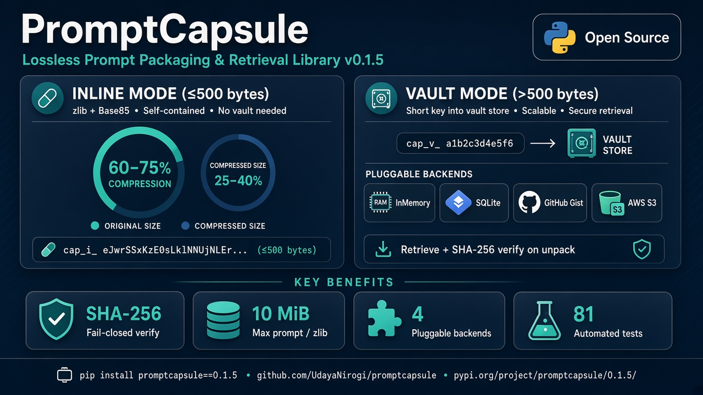

# PromptCapsule 📦

> Lossless prompt capsules for sharing, retrieval, and agent-to-agent handoff
> (v0.1.4 — fail-closed integrity, size limits, vault & Gist hardening).



## Overview

**PromptCapsule** is a generic, reusable, open-source tool for compressing and reliably reconstructing LLM prompts. It bridges the gap between short-prompt compression and long-prompt storage, giving developers an honest, transparent way to share, version-control, and manage their AI prompts.

### The Problem

When people talk about "prompt compression," they usually mean two fundamentally different things:

| Type | What It Does | Trade-off |
|------|-------------|-----------|
| **Type 1: True Compression** | Small prompts (≤500 bytes) packed inline with zlib + Base85 | No external storage; size reduction is entropy-limited |
| **Type 2: Key-Based Retrieval** | Long prompts stored in a vault; agents share a short capsule key | Requires a shared backend; the handle is ~99% smaller than a multi‑KB prompt |

**PromptCapsule** gives you **BOTH**, transparently and automatically.

### The Solution

PromptCapsule uses a **hybrid approach**:

```
Short prompts (≤500 bytes UTF-8):
  INPUT PROMPT → ZLIB COMPRESS → BASE85 ENCODE → Portable capsule string
  (self-contained, no storage needed)

Long prompts (>500 bytes):
  INPUT PROMPT → STORE IN VAULT (SQLite, GitHub Gist, S3) → Generate short hash key
  (retrieves from configured backend)
```

Both modes are **automatic** — just compress once and the library picks the best strategy. Both are **verified** — checksums ensure byte-for-byte exact reconstruction.

### Agent-to-agent handoff

A capsule is a message payload. One agent packs a prompt; another unpacks it and continues only if verification succeeds.

```python
result = pc.decompress(capsule, vault_backend=vault)  # strict=True by default
# raises IntegrityError if checksum fails — fail closed for agent handoffs
```

- **Inline** (`cap_i_…`): self-contained. No shared store. Best for short instructions (≤500 bytes).
- **Vault** (`cap_v_…`): both agents use the same backend (SQLite, GitHub Gist, or S3). The long prompt stays in the vault; only a short key moves between agents.
- Use `strict=False` only if you intentionally want plaintext with `verified=False` (legacy).

This is a use of the existing API, not a separate agent protocol, and not encryption. The project includes **81 automated tests** (core, backends, integrity, integration, and security regressions).

---

## What's new in 0.1.5 (docs clarity)

- Public docs now state **81 automated tests** (not “27”).
- Security write-up uses plain language (no internal finding codes like F07/F10).
- Limits, fixed issues, and remaining open limitations are listed clearly for PyPI readers.

## What's new in 0.1.4 (follow-up hardening)

| Change | Detail |
|--------|--------|
| Base85 integrity | Capsule payload must round-trip; trailing junk is rejected |
| Vault key-swap safety | On bind failure, returned text is empty even if `strict=False` |
| Gist backend | Retrieve requires gist owned by the token user; optional ID allowlist |

## What's new in 0.1.3 / 0.1.2 (security baseline)

Version **0.1.2** hardened the library; **0.1.3** documented limits on PyPI.

### Size & operational limits

| Limit | Value | Behavior |
|-------|-------|----------|
| Inline vs vault threshold | **500 bytes** (UTF-8) | ≤500 → inline; >500 → requires a vault backend |
| Max prompt on compress | **10 MiB** | Larger inputs raise `ValueError` |
| Max capsule string size | **10 MiB** | Oversized capsules rejected on decompress |
| Max zlib expansion | **10 MiB** | Blocks zip/zlib bombs |
| Checksum in capsule | **8 hex chars** (SHA-256 prefix) | Integrity check only — **not** a MAC / not encryption |
| Vault keys | Unguessable (`secrets.token_urlsafe`) | Not sequential counters |

```python
from promptcapsule import PromptCapsule, IntegrityError

pc = PromptCapsule()
print(pc.INLINE_THRESHOLD)       # 500
print(pc.MAX_PROMPT_SIZE)        # 10485760
print(pc.MAX_DECOMPRESSED_SIZE)  # 10485760
```

### Security issues fixed (library)

| Issue | Mitigation |
|-------|------------|
| Integrity fail-open | Default `decompress(strict=True)` raises `IntegrityError` |
| Empty / invalid checksum prefix | Exactly 8 lowercase hex characters required |
| Unbounded zlib decompress | Expansion capped at 10 MiB |
| Huge compress DoS | Compress capped at 10 MiB |
| Predictable vault keys | Cryptographic random keys |
| Vault key swap leaking another agent’s text | Fail-closed + checksum binding; failed bind returns empty text |
| Trailing junk on inline capsules | Base85 round-trip validation |
| S3 key confusion | Keys must stay under configured prefix; `..` blocked |
| Gist ID confusion | Owner check by default; optional allowlist |
| Broken HMAC helper | Module-level `hmac`; `verify_signature` works |

### Remaining limitations (still open / by design)

PromptCapsule is **packaging + retrieval**, not a full security product:

| Limitation | What it means |
|------------|----------------|
| **Not encryption** | Anyone with the capsule (inline) or vault access can read prompt text |
| **Not authentication** | No built-in agent identity, API keys, or mTLS |
| **8-hex checksum is not a MAC** | Truncated SHA-256 proves integrity of content vs prefix; use `IntegrityChecker` HMAC if you need authenticity with a shared secret |
| **Shared vault required** for long prompts | Both agents must reach the same backend with correct ACLs |
| **Custom backends** | Must implement `retrieve_with_checksum` for full binding |
| **Demo HTTP “capsule bus”** | Not in this package — if you run one, add auth, size limits, and avoid public list/open yourself |

### Recommended agent pattern

```python
from promptcapsule import PromptCapsule, IntegrityError

pc = PromptCapsule()
try:
    result = pc.decompress(capsule, vault_backend=vault)  # strict=True
except IntegrityError:
    raise  # do not act on untrusted / tampered prompts

# only then use result.text
```

---

## Features

✨ **Hybrid Compression**
- Short prompts: Inline zlib + Base85 compression
- Long prompts: Vault storage with automatic fallback
- Automatic mode selection based on size

🤝 **Agent-to-agent handoff**
- Pass a capsule instead of the full prompt
- Receiver reconstructs the original text and checks `verified`
- Inline capsules travel alone; vault capsules use a shared backend

🔒 **Integrity Verification**
- SHA256 checksums for all capsules
- Byte-for-byte exact reconstruction guarantee
- Verification status in decompression results

🎯 **Honest Positioning**
- Transparent about what it actually does (capsule strings, not LLM output compression)
- Clear comparisons vs. existing tools (LLMLingua, LangChain Hub, gzip)
- No false claims of novelty

🌍 **Pluggable Backends**
- **In-Memory**: Great for testing and prototyping
- **SQLite**: Local storage, no external dependencies
- **GitHub Gist**: Cloud storage, version control friendly
- **AWS S3**: Enterprise-grade scalability (optional)

⚙️ **Python 3.8+**
- Pure Python, minimal dependencies
- Cross-platform compatible
- Type hints throughout

---

## Installation

```bash
# Basic installation (includes in-memory and SQLite backends)
pip install promptcapsule

# With cloud storage support
pip install promptcapsule[vault]
```

### Requirements
- Python 3.8+
- No external dependencies for core functionality
- Optional: `boto3` for S3 backend, `PyGithub` for GitHub Gist backend

---

## Quick Start

### Basic Usage (Short Prompts)

```python
from promptcapsule import PromptCapsule

pc = PromptCapsule()

# Compress a prompt
prompt = "You are a helpful Python coding assistant."
capsule = pc.compress(prompt)
# capsule: "cap_i_a1b2c3d4_K*i0?5Z7....."

# Decompress anywhere, on any device/account
result = pc.decompress(capsule)
assert result.text == prompt
assert result.verified is True  # Integrity verified ✓
```

### Long Prompts with Vault Backend

```python
from promptcapsule import PromptCapsule
from promptcapsule.backends import SQLiteBackend

pc = PromptCapsule()
vault = SQLiteBackend("prompts.db")

# Compress a long, carefully-crafted prompt
long_prompt = """
You are an expert in machine learning...
[2000+ characters of detailed context]
"""

capsule = pc.compress(long_prompt, vault_backend=vault)
# capsule: "cap_v_a1b2c3d4_sql_20240921_120000_0001"

# Decompress later (data retrieves from SQLite)
result = pc.decompress(capsule, vault_backend=vault)
assert result.text == long_prompt
assert result.verified is True
```

### Real-World Scenario: Version-Controlling Prompts

```python
import json
from promptcapsule import PromptCapsule
from promptcapsule.backends import SQLiteBackend

pc = PromptCapsule()
vault = SQLiteBackend("prompts.db")

# Iterate on your prompts over time
prompts_history = {
    "v1.0": pc.compress(
        "Generate a blog post about AI",
        vault_backend=vault
    ),
    "v1.1": pc.compress(
        "Generate a blog post about AI, focused on practical applications",
        vault_backend=vault
    ),
    "v1.2": pc.compress(
        "Generate a technical blog post about AI/ML, 2000+ words, with code examples",
        vault_backend=vault
    ),
}

# Save to git
with open("prompts.json", "w") as f:
    json.dump(prompts_history, f)

# Later (or different branch), retrieve and decompress
with open("prompts.json", "r") as f:
    history = json.load(f)

for version, capsule in history.items():
    result = pc.decompress(capsule, vault_backend=vault)
    print(f"{version}: {result.text[:50]}...")
```

---

## How It Works

### Inline Mode (Short Prompts)

1. **Compress**: `prompt` → zlib (level 9) → Base85 encode → capsule
2. **Format**: `cap_i_<8-char checksum>_<encoded data>`
3. **Verify**: Decompress → compare checksum prefix
4. **Result**: Portable, self-contained capsule string

**Example**:
```
Original: "Hello world!" (12 bytes)
Capsule:  "cap_i_2f575c63_EZxgxD/'" (28 bytes)
Ratio:    ~2.3x (expected for very short content)
```

### Vault Mode (Long Prompts)

1. **Store**: `prompt` → Save to backend (SQLite/Gist/S3) → Generate key
2. **Format**: `cap_v_<8-char checksum>_<backend key>`
3. **Retrieve**: On decompress → fetch from backend using key
4. **Verify**: Compare checksum prefix with retrieved content

**Example**:
```
Original:  "You are a senior software architect..." (2,000 chars)
Capsule:   "cap_v_a1b2c3d4_sql_20240921_120000_0001" (41 chars)
Ratio:     ~48x compression (key is permanent pointer to vault)
```

### Automatic Mode Selection

```python
pc = PromptCapsule()

# Anything ≤ 500 bytes uses inline
pc.compress("short prompt")  # cap_i_...

# Anything > 500 bytes needs vault
pc.compress("A" * 600)  # Error! Need vault_backend=

# With vault, auto-selects best mode
pc.compress("short prompt", vault_backend=backend)  # Still cap_i_...
pc.compress("A" * 600, vault_backend=backend)       # cap_v_...
```

---

## Backends

### In-Memory Backend

Perfect for testing and prototyping:

```python
from promptcapsule.backends import InMemoryBackend

backend = InMemoryBackend()
capsule = pc.compress("long prompt" * 100, vault_backend=backend)
```

### SQLite Backend

Local, file-based storage:

```python
from promptcapsule.backends import SQLiteBackend

backend = SQLiteBackend("prompts.db")
# Auto-creates schema, stores prompts locally
capsule = pc.compress("long prompt" * 100, vault_backend=backend)
```

### GitHub Gist Backend

Cloud storage with version control:

```python
from promptcapsule.backends import GitHubGistBackend

backend = GitHubGistBackend(token="github_pat_...")
# Stores as private gist, returns gist ID
capsule = pc.compress("long prompt" * 100, vault_backend=backend)
```

Requires: `pip install promptcapsule[vault]`

### AWS S3 Backend

Enterprise-grade cloud storage:

```python
from promptcapsule.backends import S3Backend

backend = S3Backend(bucket="my-prompts", region="us-east-1")
# Stores in S3, returns S3 key
capsule = pc.compress("long prompt" * 100, vault_backend=backend)
```

Requires: `pip install promptcapsule[vault]`

---

## Command-Line Interface

```bash
# Compress a prompt
echo "Your prompt here" | promptcapsule compress
# Output: cap_i_a1b2c3d4_...

# Decompress a capsule
promptcapsule decompress "cap_i_a1b2c3d4_..."
# Output: Your prompt here

# With vault backend
promptcapsule compress --vault sqlite:prompts.db < prompt.txt
promptcapsule decompress --vault sqlite:prompts.db "cap_v_..."
```

---

## Comparison with Existing Tools

| Tool | What It Does | Strength | Limitation |
|------|-------------|----------|-----------|
| **LLMLingua** | Lossy semantic compression of prompts | High compression ratios | Approximate reconstruction, no exact guarantee |
| **LangChain Hub** | Cloud-hosted prompt template sharing | Easy sharing, versioning | Locked into LangChain ecosystem |
| **gzip/zlib directly** | General-purpose compression | Simple, standard | Can't store large prompts, no key-based retrieval |
| **PromptCapsule** | Hybrid lossless + vault-based retrieval | Exact reconstruction, honest, pluggable | Requires storage backend for long prompts |

---

## Use Cases

### 1️⃣ Share Prompts Across Accounts
Move carefully-crafted prompts between work and personal accounts without copy-pasting:

```python
capsule = pc.compress(my_favorite_prompt)
# Share via email, Slack, message, etc.
# Later, paste in personal account
result = pc.decompress(capsule)
```

### 2️⃣ Version-Control Your Prompts
Keep prompts in git alongside your code:

```
prompts/
  ├── article-writer-v1.0.cap
  ├── article-writer-v1.1.cap
  └── article-writer-v2.0.cap
```

### 3️⃣ Portable Prompt Library
Share a repo of prompts that works on any machine, any account:

```python
prompts = load_capsule_library("prompts.json")
for name, capsule in prompts.items():
    result = pc.decompress(capsule, vault_backend=my_vault)
    print(f"{name}: {result.text}")
```

### 4️⃣ Automated Prompt Management
Build CI/CD pipelines that validate and archive prompts:

```python
# Compress before commit
for prompt_file in glob("*.txt"):
    with open(prompt_file) as f:
        prompt = f.read()
    capsule = pc.compress(prompt, vault_backend=vault)
    save_to_metadata(capsule)

# Retrieve during deployment
capsule = load_from_metadata()
prompt = pc.decompress(capsule, vault_backend=vault).text
```

---

## API Reference

### `PromptCapsule` Class

```python
class PromptCapsule:
    def compress(
        self,
        text: str,
        vault_backend: Optional[VaultBackend] = None,
    ) -> str:
        """
        Compress a prompt into a capsule string.
        
        Args:
            text: The prompt to compress
            vault_backend: Backend for storing long prompts (required if > 500 bytes)
        
        Returns:
            Capsule string (starts with "cap_")
        
        Raises:
            ValueError: If text is empty or > 500 bytes without vault
            TypeError: If text is not a string
        """
    
    def decompress(
        self,
        capsule: str,
        vault_backend: Optional[VaultBackend] = None,
    ) -> CapsuleResult:
        """
        Decompress a capsule back to the original prompt.
        
        Args:
            capsule: The capsule string to decompress
            vault_backend: Backend for retrieving long prompts
        
        Returns:
            CapsuleResult with:
                - text: Original prompt
                - verified: Integrity check passed
                - mode: "inline" or "vault"
                - checksum: SHA256 of original
                - original_size: Bytes
                - capsule_size: Bytes
        
        Raises:
            ValueError: If capsule format is invalid
            KeyError: If vault key not found
        """
```

### `CapsuleResult` Named Tuple

```python
class CapsuleResult(NamedTuple):
    text: str              # Original prompt
    verified: bool         # Checksum matched
    mode: str              # "inline" or "vault"
    checksum: str          # SHA256 hash
    original_size: int     # Bytes
    capsule_size: int      # Bytes
```

### `VaultBackend` Abstract Class

Implement to create custom backends:

```python
class VaultBackend:
    def store(self, text: str, checksum: str) -> str:
        """Store text, return a key."""
        raise NotImplementedError
    
    def retrieve(self, key: str) -> str:
        """Retrieve text by key."""
        raise NotImplementedError
```

---

## Testing

Run the full regression test suite:

```bash
python run_tests.py
```

Expected output:
```
======================================================================
PromptCapsule - Regression Test Suite
======================================================================

Core Functionality Tests:
✓ Compress short prompt (inline mode)
✓ Reject empty strings
✓ Reject invalid types
[... 24 more tests ...]

Test Results: 81 passed
======================================================================
```

---

## Architecture Notes

### Why This Design?

1. **Hybrid approach**: Best of both worlds — inline compression for portability, vault for scale
2. **Honest positioning**: We don't claim to be better than lossy compression at reducing LLM cost — we solve a different problem (portability + exact reconstruction)
3. **Pluggable backends**: Future-proof; use SQLite today, S3 tomorrow, custom backend next week
4. **Integrity by default**: Every capsule includes a checksum; verification is automatic
5. **Zero external dependencies** for core functionality — just zlib and base64, both stdlib

### Checksum Strategy

- Uses SHA256 (64 hex chars)
- Stores first 8 chars in capsule for quick verification
- Prevents accidental corruption detection
- Does **not** provide cryptographic authentication (future: optional HMAC signing)

### Compression Levels

- **Zlib level 9**: Maximum compression
- **Base85**: Better human readability than Base64 (4-char savings per 80 bytes)
- **Trade-off**: ~2-3x size increase for very short content (overhead of capsule format)

---

## Roadmap

- [ ] CLI tool with full feature parity
- [ ] HMAC signing for optional authentication
- [ ] Async backend support
- [ ] Compression format versioning (for future improvements)
- [ ] Web UI for managing vaults
- [ ] Prompt templates + variable interpolation
- [ ] Analytics: track prompt reuse, version adoption

---

## Security Considerations

- **Integrity**: ✅ Checksums detect corruption
- **Authenticity**: ⚠️ No signing (roadmap)
- **Confidentiality**: ⚠️ Vault contents transmitted/stored in plaintext (use HTTPS, encrypted S3, private gists)
- **Access Control**: Depends on backend (GitHub: private gists, S3: IAM policies)

**Recommendation**: Treat capsule strings like URLs — they're short but semantically empty. Don't rely on them for security-critical operations.

---

## License

MIT License - see LICENSE file

---

## Contributing

Contributions welcome! Please:

1. Write tests for new features
2. Follow PEP 8 style guide
3. Add docstrings
4. Update README with examples

---

## Citation

If you use PromptCapsule in your research or project, please cite:

```bibtex
@software{promptcapsule2024,
  title={PromptCapsule: Open-source prompt compression and retrieval library},
  author={Nirogi, Udaya},
  year={2024},
  url={https://github.com/UdayaNirogi/promptcapsule}
}
```

---

## FAQ

**Q: How is this different from just using a URL shortener?**
A: URL shorteners store data on a third-party server. PromptCapsule lets you choose your own backend (SQLite locally, S3 privately, GitHub Gist for sharing, etc.). Plus, checksums guarantee integrity.

**Q: Can I use this to compress LLM outputs?**
A: No — that's a different problem (lossy compression). PromptCapsule is for *inputs* (prompts), not outputs.

**Q: Is the capsule string secure?**
A: No — treat it like a URL. The 8-char checksum prefix is for integrity, not authentication. If you need signing, that's a roadmap item.

**Q: What about very old Python versions?**
A: We support Python 3.8+. Older versions should still work (no fancy syntax), but we don't test them.

**Q: Can I use multiple backends at once?**
A: Yes! Just pass different backends to different compress/decompress calls. Each backend is independent.

---

## See Also

- [LLMLingua](https://github.com/microsoft/LLMLingua) — Lossy prompt compression
- [LangChain Hub](https://smith.langchain.com/) — Prompt management platform
- [zlib Documentation](https://www.zlib.net/) — Compression format

---

## Feedback & Support

- 📖 [Documentation](https://github.com/UdayaNirogi/promptcapsule)
- 🐛 [Report Issues](https://github.com/UdayaNirogi/promptcapsule/issues)
- 💬 [Discussions](https://github.com/UdayaNirogi/promptcapsule/discussions)
- 📧 Email: udaya@example.com

---

**Made with ❤️ for developers who care about their prompts.**
